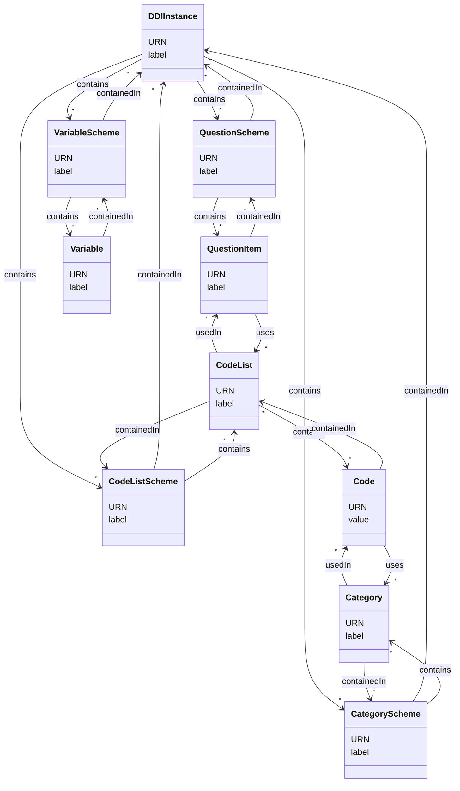

# Addict

A DDI catalog tool.

## Resources

[DDI resources](./resources/README.md)

## Application

[Source code](./app/README.md)

## Addict DDI support

```mermaid
classDiagram

class DDIInstance {
URN
label
}
class QuestionScheme {
URN
label
}
class QuestionItem {
URN
label
}
class CodeListScheme {
URN
label
}
class CodeList {
URN
label
}
class Code {
URN
value
}
class VariableScheme {
URN
label
}
class Variable {
URN
label
}
class CategoryScheme {
URN
label
}
class Category {
URN
label
}

DDIInstance --> "*"  QuestionScheme : contains
QuestionScheme --> "*" DDIInstance  : containedIn

DDIInstance --> "*" CodeListScheme : contains
CodeListScheme --> "*" DDIInstance  : containedIn

DDIInstance --> "*" VariableScheme : contains
VariableScheme --> "*" DDIInstance  : containedIn

DDIInstance --> "*" CategoryScheme : contains
CategoryScheme --> "*" DDIInstance  : containedIn

QuestionScheme --> "*"  QuestionItem : contains
QuestionItem --> "*"  QuestionScheme : containedIn

CodeListScheme --> "*" CodeList : contains
CodeList --> "*" CodeListScheme : containedIn

CodeList --> "*" Code : contains
Code --> "*" CodeList : containedIn

VariableScheme --> "*" Variable : contains
Variable --> "*" VariableScheme : containedIn

CategoryScheme --> "*" Category : contains
Category --> "*" CategoryScheme : containedIn

CodeList "*" <-- QuestionItem : uses
QuestionItem "*" <-- CodeList : usedIn

Category "*" <-- Code : uses
Code "*" <-- Category : usedIn
```