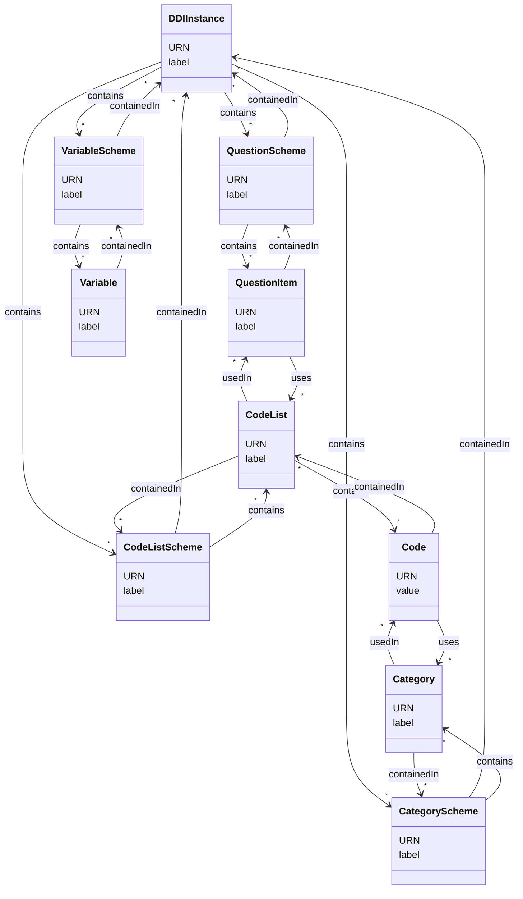

# Addict

A DDI catalog tool.

## Motivations

Addict is a React TS proof of concept to visualize DDI resources.

It's entirely client side, based on Github files, configurable through environment variables (see [here](./app/.env)).

Addict will display folders and files stored in `resources` folder.

### Interested in the project?

You can provide pull request [here](https://github.com/Making-Sense-Info/Addict/pulls) to add your resources, or connect your own Github repository to the app (_To greatly increase Github API rate limit, it is advisable to define a GITHUB_TOKEN._).

If you encounter any problems, if you have great ideas, you can write an issue [here](https://github.com/Making-Sense-Info/Addict/issues).

## Repository resources

[DDI resources](./resources)

## Addict application

[Source code](./app)

### DDI support

The current version of Addict supports the following objects and links:

